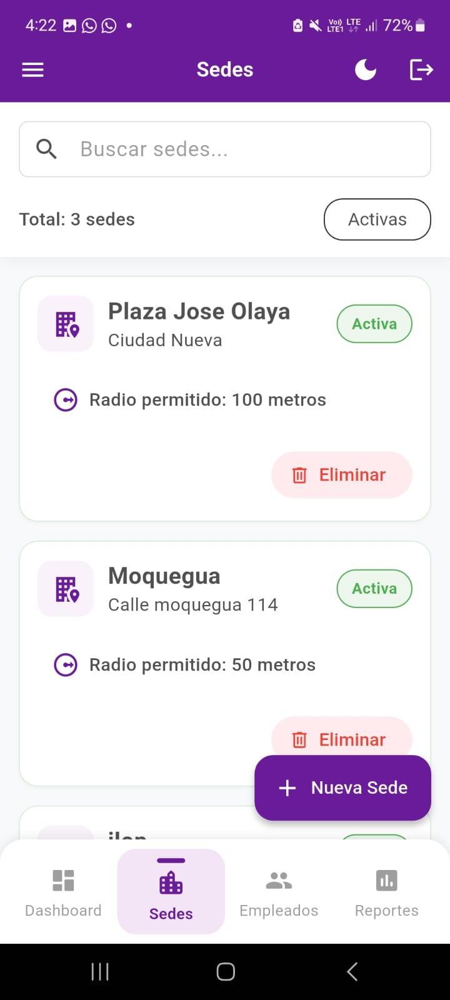
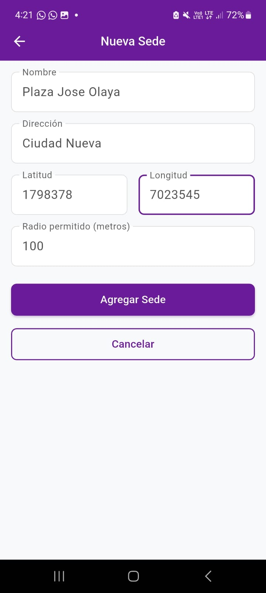
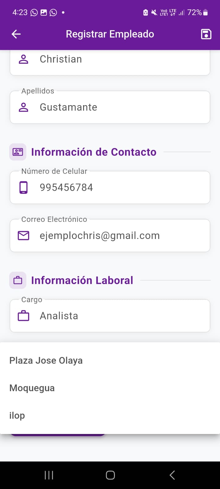

# SM2_EXAMEN_PRACTICO: Control de Asistencia GeoFace

**Autor:** Brayar Christian Lopez Catunta
**Repositorio GitHub:** [https://github.com/BCZLopezCatunta/SM2_EXAMEN_PRACTICO](https://github.com/BCZLopezCatunta/SM2_EXAMEN_PRACTICO)

## Descripción del Proyecto

Este proyecto consiste en una aplicación móvil y un panel web administrativo para el control de asistencia de empleados utilizando geolocalización y reconocimiento facial. El sistema está diseñado para la empresa Arod Contratistas Generales S.R.L., con el objetivo de optimizar el proceso de registro de asistencia, asegurar la precisión de los datos y facilitar la gestión administrativa.

Este README se enfoca en dos funcionalidades clave implementadas para el rol de administrador: la **Gestión de Sedes** y la **Asignación de Empleados a Sedes**.

## Funcionalidades Implementadas

A continuación, se detallan las dos historias de usuario seleccionadas del Product Backlog que han sido implementadas:

### 1. Gestión de Sedes

**Historia de Usuario (ID: 5):**
Como administrador, quiero registrar y gestionar sedes con su nombre, dirección y coordenadas GPS, para definir con precisión las ubicaciones donde los empleados pueden registrar su asistencia.

**Criterios de Aceptación Principales:**
1.  El sistema debe permitir al administrador crear nuevas sedes ingresando un nombre, una dirección textual y las coordenadas geográficas (latitud y longitud) a través de un formulario en el panel web.
2.  El sistema debe permitir visualizar una lista de todas las sedes registradas, mostrando su nombre, dirección y un indicador de su estado (ej. activa/inactiva).
3.  El sistema debe permitir modificar los datos de una sede existente, incluyendo sus coordenadas GPS.
4.  El sistema debe permitir eliminar una sede existente (con las consideraciones apropiadas si tiene empleados asignados).
5.  El sistema debe realizar validaciones básicas sobre los datos ingresados (ej. campos obligatorios, formato de coordenadas si aplica).

**Archivos Clave para esta Funcionalidad:**
*   `AdminLayout.dart` (para el acceso al módulo de sedes).
*   `SedesPage.dart` o `ListaSedesScreen.dart` (para listar sedes y dar acceso a crear/editar).
*   `FormularioSedePage.dart` o `CrearEditarSedeScreen.dart` (el formulario para ingresar/modificar datos de la sede).
*   `SedeModel.dart` (el modelo de datos para `Sede`, incluyendo nombre, dirección, latitud, longitud, estado).
*   `SedeController.dart` o `SedeProvider.dart` (la lógica para el CRUD de sedes, interactuando con `FirebaseService`).

**Capturas de Pantalla (Panel Web):**
*   **Listado de Sedes:**
    *   *(Descripción: Panel administrativo web mostrando una tabla con el listado de sedes. Columnas: 'Nombre Sede', 'Dirección', 'Coordenadas', 'Estado', 'Acciones'. Botón 'Registrar Nueva Sede'.)*
    *   
*   **Formulario de Registro/Edición de Sede:**
    *   *(Descripción: Formulario para registrar/editar una sede con campos para nombre, dirección, latitud, longitud y estado. Botones 'Guardar' y 'Cancelar'.)*
    *   

### 2. Asignación de Empleados a Sedes

**Historia de Usuario (ID: 6):**
Como administrador, quiero asignar empleados a una sede específica, para asegurar que solo puedan marcar asistencia en la ubicación correspondiente.

**Criterios de Aceptación Principales:**
1.  Al agregar o editar un empleado desde el panel web, el formulario debe incluir un campo (ej. desplegable) que muestre un listado de las sedes activas existentes, permitiendo al administrador asignar el empleado a una de ellas.
2.  El sistema debe guardar la asociación entre el empleado y la sede seleccionada.
3.  (Implícito para la app móvil del empleado) Un empleado solo podrá marcar asistencia si su ubicación GPS actual se encuentra dentro del radio de tolerancia de su sede asignada.

**Archivos Clave para esta Funcionalidad:**
*   `AdminLayout.dart` (para el acceso al módulo de empleados).
*   `EmpleadosPage.dart` o `ListaEmpleadosScreen.dart` (para listar empleados y dar acceso a crear/editar).
*   `FormularioEmpleadoPage.dart` o `CrearEditarEmpleadoScreen.dart` (el formulario para ingresar/modificar datos del empleado, incluyendo el selector de sedes).
*   `EmpleadoModel.dart` (el modelo de datos para `Empleado`, incluyendo sus datos personales y un campo como `sedeId` o `idSedeAsignada`).
*   `SedeModel.dart` (referenciado por `EmpleadoModel` y utilizado para poblar el selector de sedes).
*   `EmpleadoController.dart` o `EmpleadoProvider.dart` (la lógica para el CRUD de empleados, incluyendo la gestión del campo `sedeId`).
*   `SedeController.dart` o `SedeProvider.dart` (para obtener la lista de sedes activas para el selector).

**Capturas de Pantalla (Panel Web):**
*   **Formulario de Registro/Edición de Empleado con Asignación de Sede:**
    *   *(Descripción: Formulario para registrar/editar un empleado con campos para datos personales y un desplegable para 'Asignar a Sede' que lista las sedes activas.)*
    *   

## Enlaces y Referencias

A continuación, se listan los recursos externos, librerías y APIs que son fundamentales o altamente probables de ser utilizados en el desarrollo del proyecto:

### Framework de Desarrollo y Lenguaje:
*   **Flutter:** Framework de UI de Google para construir aplicaciones compiladas nativamente para móvil (Android), web y escritorio desde una única base de código.
    *   Enlace: [https://flutter.dev/](https://flutter.dev/)
*   **Dart:** Lenguaje de programación optimizado para clientes, utilizado para desarrollar con Flutter.
    *   Enlace: [https://dart.dev/](https://dart.dev/)

### Backend y Base de Datos (Plataforma Firebase):
*   **Firebase:** Plataforma integral de desarrollo de aplicaciones de Google.
    *   Enlace General: [https://firebase.google.com/](https://firebase.google.com/)
*   **FlutterFire (Plugins de Flutter para Firebase):** Conjunto de plugins para integrar servicios de Firebase en aplicaciones Flutter.
    *   Enlace: [https://firebase.flutter.dev/](https://firebase.flutter.dev/)
*   **Cloud Firestore:** Base de datos NoSQL, escalable y flexible para almacenar datos de la aplicación (usuarios, empleados, sedes, asistencias, etc.).
    *   Enlace: [https://firebase.google.com/docs/firestore](https://firebase.google.com/docs/firestore)
*   **Firebase Authentication:** Para gestionar la autenticación de usuarios (empleados en la app móvil y administradores en el panel web).
    *   Enlace: [https://firebase.google.com/docs/auth](https://firebase.google.com/docs/auth)
*   **Firebase Storage (Cloud Storage for Firebase):** Para almacenar archivos como imágenes de reconocimiento facial, fotos de perfil o reportes generados.
    *   Enlace: [https://firebase.google.com/docs/storage](https://firebase.google.com/docs/storage)
*   **(Opcional) Cloud Functions for Firebase:** Para ejecutar lógica de backend sin servidor (ej., validaciones complejas, procesamiento de datos post-registro, notificaciones).
    *   Enlace: [https://firebase.google.com/docs/functions](https://firebase.google.com/docs/functions)

### Gestión de Estado en Flutter:
*   **Provider:** Librería para la gestión de estado en Flutter.
    *   Enlace: [https://pub.dev/packages/provider](https://pub.dev/packages/provider)

### Funcionalidades de Cámara y Reconocimiento Facial:
*   **`camera` (Flutter Package):** Plugin para acceder y controlar la cámara del dispositivo.
    *   Enlace: [https://pub.dev/packages/camera](https://pub.dev/packages/camera)
*   **`google_mlkit_face_detection` (Flutter Package):** Para detección de rostros.
    *   Enlace: [https://pub.dev/packages/google_mlkit_face_detection](https://pub.dev/packages/google_mlkit_face_detection)

### Geolocalización:
*   **`geolocator` (Flutter Package):** Plugin para obtener la ubicación GPS.
    *   Enlace: [https://pub.dev/packages/geolocator](https://pub.dev/packages/geolocator)
*   **(Opcional) `google_maps_flutter` (Flutter Package):** Para integrar Google Maps.
    *   Enlace: [https://pub.dev/packages/google_maps_flutter](https://pub.dev/packages/google_maps_flutter)

### Manejo de Permisos en el Dispositivo:
*   **`permission_handler` (Flutter Package):** Para solicitar y verificar permisos.
    *   Enlace: [https://pub.dev/packages/permission_handler](https://pub.dev/packages/permission_handler)

### Utilidades Adicionales:
*   **`http` (Dart Package):** Para realizar solicitudes HTTP.
    *   Enlace: [https://pub.dev/packages/http](https://pub.dev/packages/http)
*   **`intl` (Dart Package):** Para internacionalización y formateo.
    *   Enlace: [https://pub.dev/packages/intl](https://pub.dev/packages/intl)
*   **`path_provider` (Flutter Package):** Para acceder a rutas del sistema de archivos.
    *   Enlace: [https://pub.dev/packages/path_provider](https://pub.dev/packages/path_provider)
*   **`uuid` (Dart Package):** Para generar identificadores únicos universales (UUIDs).
    *   Enlace: [https://pub.dev/packages/uuid](https://pub.dev/packages/uuid)

---
**Nota:** Recuerda reemplazar los placeholders `[PENDIENTE: Insertar captura de pantalla ... aquí]` con las imágenes reales de tu aplicación. Puedes subirlas a tu repositorio GitHub (por ejemplo, en una carpeta `docs/images/`) y luego referenciarlas en el README usando la sintaxis de Markdown para imágenes: ``.